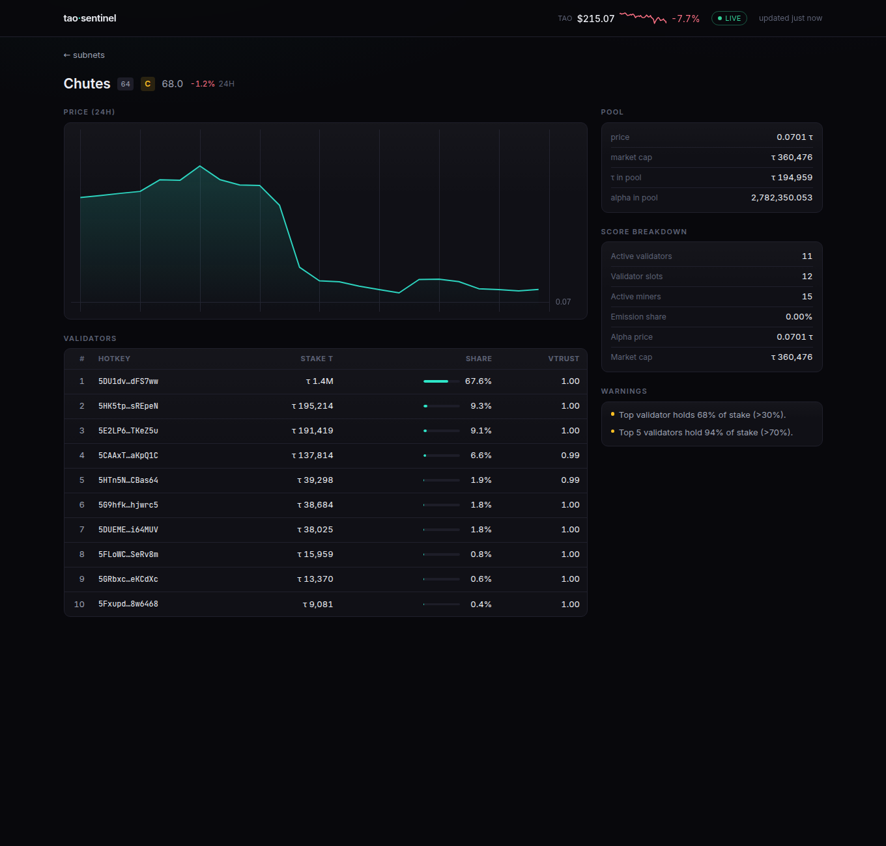

# tao-sentinel

A Bittensor watchtower built on the [Taostats API](https://docs.taostats.io). It watches
subnets, prices, and stake for you and tells you when something changes.

What it does:

- **Alerts.** Nine watch types: alpha price moves, stake changes, validator
  deregistrations, emission shifts, the TAO/USD price, subnet market cap moves,
  registration cost drops, new subnets, and 24h price trends. Alerts go to the console,
  Telegram, or a webhook.
- **Digests and cooldown.** Telegram alerts are batched into one message per tick, grouped
  by severity. A configurable cooldown suppresses repeats unless severity escalates.
  Webhooks stay one POST per alert so machine consumers keep a stable shape.
- **dTAO portfolio.** Values any coldkey's alpha stake across subnets in TAO and USD, with
  per-position share percentages.
- **Subnet health.** Scores and grades subnets (A-F) on emission share, neuron counts, and
  market presence. Validator stake concentration is shown separately as risk warnings.
- **Dashboard.** A dark web UI with a sortable, filterable, paginated subnet table, a
  pinned watchlist with sparklines, per-subnet detail pages, and your portfolio.

Everything runs without an API key in `--mock` mode, against deterministic fixtures, so
you can try the whole tool offline first.

**Live demo: [tao.insightfulbytes.com](https://tao.insightfulbytes.com)** with real
mainnet data on the Taostats free tier.


The per-subnet detail page shows the price chart, pool reserves, score breakdown, and the
top validators by stake, with concentration called out as warnings:



> Open source. Issues and PRs welcome.
>
> Write-up from the build:
> [The phantom table cell, and other bugs that lied to me](https://www.insightfulbytes.com/blog/phantom-table-cell-bugs-that-lied)

---

## Install

Requires Python 3.10+.

```bash
# from a clone of this repo
pip install -e .

# with dev/test extras (pytest)
pip install -e ".[dev]"
```

This installs the `tao-sentinel` command. Confirm it works in mock mode (no key needed):

```bash
tao-sentinel scan --mock
```

---

## Quickstart

Most commands take a `--mock` switch. In mock mode every command works end to end against
built-in fixtures (subnets `apex`, `targon`, `chutes`, a sample coldkey with three
positions, and a TAO price of $350). No network, no API key. Drop `--mock` and supply a
key to hit the live Taostats API.

### `init`: write an example config

```bash
tao-sentinel init
```

Writes a commented `./sentinel.yaml` you can edit (see [Configuration](#configuration)).

### `scan`: subnet health

```bash
# scan all subnets (mock demo)
tao-sentinel scan --mock

# scan a single subnet by netuid (also pulls its validator set)
tao-sentinel scan 1 --mock

# machine-readable output
tao-sentinel scan --mock --json
```

Prints a table of subnets with a 0-100 health score and a color-coded grade
(`A` >= 85, `B` >= 70, `C` >= 55, `D` >= 40, else `F`), plus plain-language warnings.
The score formula is the same in both modes, so a subnet's grade never changes between
the full list and its detail view. Single-subnet scans additionally report validator
stake concentration as warnings.

### `portfolio`: value a coldkey's dTAO stake

```bash
# the mock fixture coldkey (holds three positions), copy-paste verbatim
tao-sentinel portfolio 5MockColdkey0000000000000000000000000000000000000000000 --mock
tao-sentinel portfolio <COLDKEY_SS58> --json
```

Reports the TAO and USD value of each stake position. A position's `value_tao` is
resolved in this order:

1. The API-provided value (`balance_as_tao`) when present. This is the authoritative
   valuation from Taostats and is used as-is.
2. Otherwise `alpha_staked * pool.price_tao`, when the subnet has a pool entry.
3. Otherwise `None`. The position has no derivable value and is left out of the total.

`total_value_tao` sums every position with a value. Because the API value is preferred,
root (netuid 0) positions are included even though root has no dTAO pool entry, so the
total reflects your full stake.

### `watch`: run the alert engine

```bash
# single pass: take a snapshot, compare against saved state, dispatch alerts
tao-sentinel watch --config sentinel.yaml --once --mock

# run forever, polling on the configured interval
tao-sentinel watch --config sentinel.yaml --mock
```

Both modes deliver alerts to all configured notifiers (console, Telegram, webhook).
`--once` is a single tick of the same engine, which makes it the way to test your
Telegram or webhook setup, and makes cron-driven deployments work. Pass `--no-notify`
for a console-only dry run.

The engine is careful with API calls: it fetches pools once (shared by `price_change`,
`market_cap`, and `new_subnet`), subnets once (shared by `emission_shift` and
`registration_cost`), stakes only for watched coldkeys, validators only for watched
netuids, the TAO/USD price once per tick only if a `tao_price` watch exists, and
per-netuid 24h history for `price_trend` watches through a 6-hour cache. State persists
between runs at `state_path` (default `~/.tao-sentinel/state.json`), so changes are
measured against the last snapshot.

#### Alert digests and cooldown

Before dispatch, the engine deduplicates: an alert is suppressed if an identical one
(same rule type, netuid, coldkey, and hotkey) already fired within
`alert_cooldown_minutes`, unless its severity escalated (`info` < `warning` <
`critical`), which always sends. Cooldown timestamps persist in the state file, so dedup
survives restarts. Set `alert_cooldown_minutes: 0` to disable it.

The surviving alerts are then handed to each notifier as a batch:

- Telegram sends one combined, severity-grouped digest per tick (capped near 3500 chars,
  with an "...and N more" marker on overflow).
- Webhook delivers one POST per alert. The per-alert JSON shape is unchanged from
  v0.1.0, so existing consumers keep working.
- Console prints each alert.

### `serve`: the web dashboard

```bash
tao-sentinel serve --config sentinel.yaml --port 8787 --mock
```

Then open <http://localhost:8787>.

The dashboard is a React SPA (Vite, TypeScript, Tailwind CSS, TanStack Query/Table,
TradingView's `lightweight-charts`, self-hosted Inter, no CDNs) served by the same
FastAPI process from `tao_sentinel/web/static`. The build is produced by `npm run build`
in `frontend/` and ships inside the wheel and the Docker image, so end users never need
node. Source checkouts without the build fall back to a minimal server-rendered page.

```bash
# frontend development: hot-reload SPA proxied onto a mock API
tao-sentinel serve --mock --port 8787 &
cd frontend && npm install && npm run dev
```

Routes:

- `GET /` is the dashboard. A pinned watchlist (the netuids in your config's
  `watchlist`) sits above the main table, each with a sparkline of its trailing alpha
  price; the header carries a TAO/USD price sparkline. The main table sorts by any
  column, filters by name or netuid, has grade filter chips, and is paginated (25/50/100
  rows per page). On narrow screens, columns that do not fit are hidden and a tap on the
  row expands them inline. Every row links to its subnet detail page. Below the table:
  a portfolio card when a coldkey is configured, a recent-alerts timeline, and a
  data-freshness footer. Auto-refreshes every 300s.
- `GET /api/status` is the dashboard's data as JSON (subnets, portfolio, alerts, and a
  `meta` block with `generated_at`, `tao_price_usd`, and `tao_price_spark`). Sparkline
  series are included only for watchlist netuids.
- `GET /subnet/{netuid}` is the per-subnet detail page: a single-subnet scan, validator
  stake concentration as explicit risk warnings, pool detail (price, market cap, TAO and
  alpha reserves), a 24h chart with percent change, and the top 10 validators by stake
  with share percentages.
- `GET /api/subnet/{netuid}` is the same detail as JSON. Unknown netuids return a 404
  JSON body.

> The portfolio section is populated from the first coldkey referenced by any watch. To
> see a populated portfolio in `--mock` mode, set that watch's `coldkey` to the fixture
> coldkey `5MockColdkey0000000000000000000000000000000000000000000` in `sentinel.yaml`.
> Any other address has no fixture positions and renders an empty card.

The dashboard caches the main scan/portfolio data for 5 minutes to respect the API rate
limit. Sparklines (watchlist subnets and the TAO price) use a 6-hour cache because each
one costs a history call. Per-subnet detail results are cached for 1 hour behind an LRU
cap of 16 entries, so arbitrary `/subnet/{netuid}` traffic cannot run away with the
budget.

When multiple processes share one API key (the compose stack runs a watcher and a
dashboard), they coordinate through a cross-process token bucket: a `flock`-guarded
`ratelimit.json` next to the state file. The pair stays at the real 5 calls/min instead
of each running its own bucket and bursting to double that. Ad-hoc CLI runs on the same
machine join the same bucket automatically.

---

## Configuration

`tao-sentinel init` writes a commented `sentinel.yaml`. Full reference:

```yaml
# How to authenticate to the Taostats API.
#   - omit / leave null to run in mock mode (or pass --mock)
#   - put the raw key here, OR
#   - use "env:VARNAME" to read it from an environment variable, OR
#   - leave unset and export TAOSTATS_API_KEY (honored as a fallback)
api_key: "env:TAOSTATS_API_KEY"

# Optional Telegram notifier.
telegram:
  bot_token: "123456:ABC-DEF..."
  chat_id: "-1001234567890"

# Optional generic webhook notifier (alert JSON is POSTed here).
webhook_url: "https://example.com/hooks/tao-sentinel"

# How often run_forever polls, in seconds.
poll_interval_seconds: 3600

# Where alert engine state (last snapshot + cooldown timestamps) is stored.
state_path: "~/.tao-sentinel/state.json"

# Suppress an identical alert (same rule type + subnet + coldkey + hotkey)
# fired within this many minutes, unless its severity escalated. 0 disables.
alert_cooldown_minutes: 60

# Subnets to pin at the top of the dashboard, each with a sparkline.
# Capped at 12; each pinned subnet costs one 6h-cached history call.
watchlist: [1, 64]

# What to watch. Each entry is one rule.
watches:
  # price_change: pool price_tao moves beyond threshold_pct.
  - type: price_change
    netuid: 1
    threshold_pct: 10.0

  # stake_change: a coldkey's position alpha_staked moves beyond
  # threshold_pct (or a position appears / disappears). In --mock mode use the
  # fixture coldkey below to get a populated portfolio in `portfolio`/`serve`;
  # replace it with your own ss58 for live mode.
  - type: stake_change
    coldkey: "5MockColdkey0000000000000000000000000000000000000000000"
    threshold_pct: 10.0

  # validator_dereg: a hotkey that was present+active on a netuid
  # goes missing/inactive (severity: critical).
  - type: validator_dereg
    netuid: 1
    hotkey: "5Validator..."

  # emission_shift: a subnet's emission_pct moves beyond threshold_pct (relative).
  - type: emission_shift
    netuid: 4
    threshold_pct: 10.0

  # tao_price: the TAO/USD spot price moves beyond threshold_pct (no netuid).
  - type: tao_price
    threshold_pct: 5.0

  # market_cap: a subnet pool's market cap (TAO) moves beyond threshold_pct.
  - type: market_cap
    netuid: 1
    threshold_pct: 15.0

  # registration_cost: a subnet's registration cost DROPS by threshold_pct.
  - type: registration_cost
    netuid: 4
    threshold_pct: 20.0

  # new_subnet: a brand-new subnet appears in the pool list (no netuid).
  - type: new_subnet

  # price_trend: |change| over the trailing 24h history >= threshold_pct
  # (requires netuid; uses the 6h-cached history endpoint).
  - type: price_trend
    netuid: 64
    threshold_pct: 25.0
```

### Config fields

| Field | Type | Default | Notes |
|---|---|---|---|
| `api_key` | string or null | none | Raw key, `env:VARNAME` indirection (resolved at load), or null. `TAOSTATS_API_KEY` env var is honored as a fallback. |
| `telegram.bot_token` | string | - | Telegram bot token for `TelegramNotifier`. |
| `telegram.chat_id` | string | - | Target chat ID. |
| `webhook_url` | string or null | none | Generic webhook; alert JSON is POSTed here. |
| `poll_interval_seconds` | int | `3600` | Sleep between polls in `run_forever`. A 1-hour tick keeps the engine within the free-tier monthly budget (see [Rate limits](#rate-limits-free-tier)). Shorter intervals multiply monthly call volume proportionally. |
| `state_path` | string | `~/.tao-sentinel/state.json` | Where the last snapshot and cooldown timestamps are persisted. |
| `alert_cooldown_minutes` | int | `60` | Suppress an identical alert that fired within this window, unless its severity escalated. `0` disables dedup. |
| `watchlist` | list of int | `[]` | Subnets pinned at the top of the dashboard, each with a sparkline. Capped at 12; must be unique netuids. Each pinned subnet costs one 6h-cached history call. |
| `watches` | list | `[]` | One entry per rule. |

### Watch fields

| Field | Type | Default | Notes |
|---|---|---|---|
| `type` | string | - | One of the nine watch types below. |
| `netuid` | int or null | none | Subnet to watch. Required for `price_trend`; optional for the other per-subnet rules; ignored by `tao_price` and `new_subnet`. |
| `coldkey` | string or null | none | Coldkey ss58 (stake rules). |
| `hotkey` | string or null | none | Hotkey ss58 (validator rules). |
| `threshold_pct` | float | `10.0` | Percent-move threshold that triggers the rule. |

### Watch types

Severities marked "critical at 2x" escalate from `warning` to `critical` when the move is
at least twice `threshold_pct`. The "extra API cost" column is the per-tick HTTP cost
beyond the shared `pools`/`subnets` fetches the engine already makes (each of those is
paginated; see [Rate limits](#rate-limits-free-tier)).

| Type | Fires when | Needs `netuid` | Severity | Extra API cost |
|---|---|---|---|---|
| `price_change` | a subnet pool's alpha `price_tao` moves beyond `threshold_pct` between ticks | optional | warning, critical at 2x | reuses `pools` (0) |
| `stake_change` | a watched coldkey position's `alpha_staked` moves beyond `threshold_pct`, or a position appears or disappears | no (uses `coldkey`) | info/warning/critical by move | 1 stake source per watched coldkey |
| `validator_dereg` | a watched hotkey that was present and active on a netuid goes missing or inactive | yes (+`hotkey`) | critical | 1 validators source per watched netuid |
| `emission_shift` | a subnet's `emission_pct` moves beyond `threshold_pct` (relative) | optional | warning | reuses `subnets` (0) |
| `tao_price` | the TAO/USD spot price moves beyond `threshold_pct` | no | warning, critical at 2x | +1 call/tick when any `tao_price` watch is present |
| `market_cap` | a subnet pool's `market_cap_tao` moves beyond `threshold_pct` | optional | warning, critical at 2x | reuses `pools` (0) |
| `registration_cost` | a subnet's `registration_cost_tao` drops by at least `threshold_pct` | optional | warning | reuses `subnets` (0) |
| `new_subnet` | a netuid appears in the pool set that was absent last tick (never fires on first run) | no | info | reuses `pools` (0) |
| `price_trend` | the trailing-24h alpha price change for a netuid is at least `threshold_pct` | yes | warning, critical at 2x | 1 history call per watched netuid per 6h (cached) |

---

## Getting an API key

Live mode needs a Taostats API key.

1. Sign in at the Taostats Pro dashboard: <https://dash.taostats.io> (an alias for
   <https://taostats.io/pro>).
2. Create an API key under **API Keys**. Keys look like
   `tao-7051ffef-a15f-4608-9fea-1142d61f09a1:92a1cf8a`.
3. Provide it via `api_key` in `sentinel.yaml` (raw or `env:VARNAME`) or by exporting
   `TAOSTATS_API_KEY`:

   ```bash
   export TAOSTATS_API_KEY="tao-...:......"
   tao-sentinel scan
   ```

The key is sent as a raw `Authorization` header with no `Bearer ` prefix. Adding the
prefix is a common cause of `401`s.

## Rate limits (free tier)

The Taostats free tier is 5 calls/minute and, as this project's planning target, roughly
10k calls/month. tao-sentinel is built to live within that:

- A blocking, thread-safe token-bucket rate limiter throttles the HTTP client to the
  configured per-minute limit (5 by default). You will not burst past it, even when the
  dashboard serves concurrent requests off one shared client.
- The alert engine fetches the minimum sources needed per poll, as described under
  [`watch`](#watch-run-the-alert-engine).
- The subnet scanner only pulls per-validator detail for single-netuid scans. Scanning
  all subnets scores from the subnet list alone.
- The dashboard caches the main scan/portfolio for 5 minutes and shares one pool fetch
  between the health scan and the portfolio per refill. Sparklines use a 6h cache and
  detail pages a 1h cache behind a 16-entry LRU cap.

### Counting calls: list endpoints are paginated

The Taostats list endpoints return 100 rows per page, so a single logical fetch such as
`get_subnets()`, `get_pools()`, or `get_validators()` is not one HTTP call. It is
`ceil(rows / 100)` calls. Bittensor already has well over 100 subnets, so `get_subnets()`
and `get_pools()` are 2 HTTP calls each today (3 once a list exceeds 200 rows). Budget
math must count pages, not sources:

```
HTTP calls per tick   = sum over each touched source of ceil(rows / 100)
monthly calls         = calls_per_tick * (3600 / poll_interval_seconds) * 24 * 30
                        + 6h-cached history (price_trend + watchlist sparklines + TAO spark)
                        + uncached /subnet/{netuid} detail views (1 each, LRU-capped at 16)
```

Worked example for the watches in the example config. The shared list sources each span
two pages on mainnet today: `pools` (2) + `subnets` (2) + one watched coldkey (1) + one
watched netuid for `validator_dereg` (1) + the TAO price for the `tao_price` watch (1)
= 7 HTTP calls/tick. The single `price_trend` watch adds a history call only every 6h:
1 netuid x (30 x 24 / 6) is about 120 calls/month.

| `poll_interval_seconds` | ticks/hour | calls/tick | per-tick/month | + history | calls/month | verdict |
|---|---|---|---|---|---|---|
| `3600` (default, hourly) | 1 | 7 | 5,040 | 120 | **5,160** | safe (< 10k) |
| `900` | 4 | 7 | 20,160 | 120 | 20,280 | over budget |
| `300` | 12 | 7 | 60,480 | 120 | 60,600 | about 6x over budget |

This is why the default `poll_interval_seconds` is 3600 rather than a few minutes: each
list source is two pages today, so the per-tick cost is roughly double a naive "one call
per source" estimate, and a sub-hourly interval blows past the monthly cap. Re-check the
budget if a list grows past the next 100-row boundary or your watch set grows.

The dashboard spends separately from the watch engine (it is a different process and
does not run on the poll interval): each pinned watchlist subnet costs one history call
per 6h, the header TAO sparkline one per 6h, and each uncached `/subnet/{netuid}` view
one call, with at most 16 detail results cached under the LRU cap. With the example
`watchlist: [1, 64]` that is 2 sparkline calls plus the TAO spark per 6h, which is
negligible against the monthly cap.

Higher limits are available on paid plans at <https://taostats.io/pro>. The exact
monthly cap is not officially published by Taostats; treat the 10k/month figure as a
conservative planning number.

---

## Files written on disk (permissions)

Two files tao-sentinel writes can hold sensitive data, so both are created with
owner-only `0600` permissions (and their parent directory with `0700`):

- `sentinel.yaml` (written by `tao-sentinel init`) may contain your raw Taostats
  `api_key`, your Telegram `bot_token`, and a `webhook_url`. Keep it private on shared
  hosts.
- The state file (`state_path`, default `~/.tao-sentinel/state.json`) holds the watched
  coldkey/hotkey ss58 addresses and the persisted snapshot of portfolio positions. It
  does not contain the API key or bot token, but it links this host's operator to
  specific wallets, so it is also written `0600`.

If you provide your own `sentinel.yaml` or relocate the state file, keep the permissions
restrictive yourself.

---

## Endpoint paths are patchable

Taostats occasionally changes or versions its endpoint paths. All endpoint paths are
centralized in a single `ENDPOINTS` dict in
[`tao_sentinel/api.py`](tao_sentinel/api.py). If a path changes, edit that one dict.
Each entry carries a comment noting how confident the original API research was in it.

---

## License

MIT. See [LICENSE](LICENSE).
