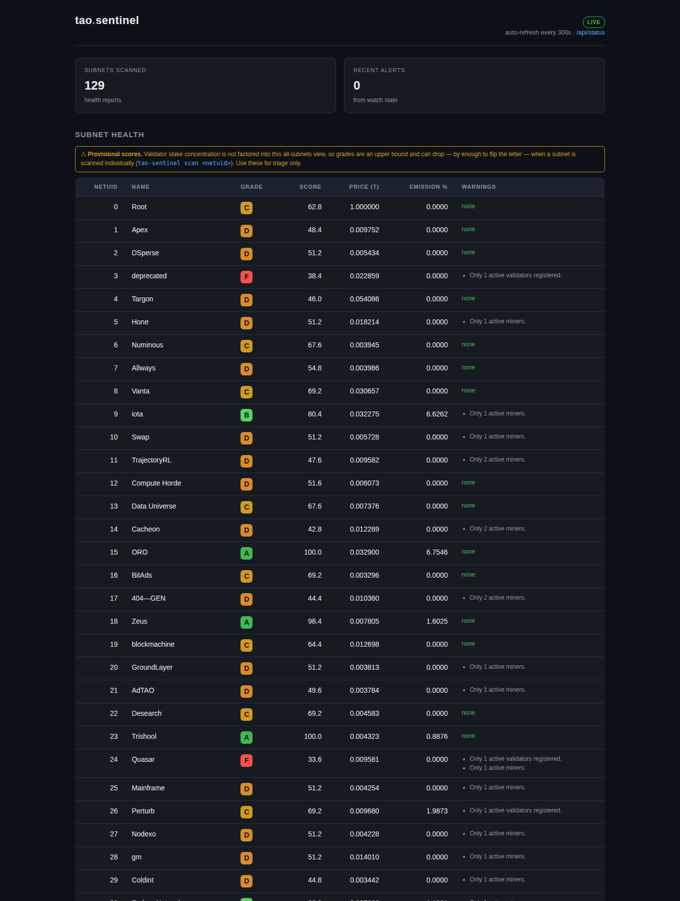

# tao-sentinel

A **Bittensor watchtower** built on the [Taostats API](https://docs.taostats.io). One small,
self-hostable tool that keeps an eye on the things that move while you sleep:

- **Alerts** — get notified on price moves, stake changes, validator deregistrations, and
  emission shifts via the console, Telegram, or a generic webhook.
- **dTAO portfolio** — value any coldkey's alpha stake across subnets in TAO and USD.
- **Subnet health** — score and grade subnets (A–F) on validator-stake concentration,
  emission share, neuron counts, and market presence.
- **Dashboard** — a clean, dependency-free dark web page summarizing health, your portfolio,
  and recent alerts, with auto-refresh.

Everything runs **without an API key** in `--mock` mode, so you can try the whole tool
offline against deterministic fixtures before you sign up for anything.

**Live demo: [tao.insightfulbytes.com](https://tao.insightfulbytes.com)** — real mainnet
data, refreshed against the Taostats free tier.



> Open-source reputation project. Issues and PRs welcome.

---

## Screenshots

> _Placeholder — add screenshots here._
>
> - `docs/screenshot-dashboard.png` — the web dashboard
> - `docs/screenshot-scan.png` — `tao-sentinel scan` rich table
> - `docs/screenshot-portfolio.png` — `tao-sentinel portfolio` output

---

## Install

Requires **Python 3.10+**.

```bash
# from a clone of this repo
pip install -e .

# with dev/test extras (pytest)
pip install -e ".[dev]"
```

This installs the `tao-sentinel` command. Confirm it works in mock mode (no key needed):

```bash
tao-sentinel scan --mock
```

---

## Quickstart

`tao-sentinel` has a global `--mock` switch on the relevant commands. In mock mode every
command works end-to-end against built-in deterministic fixtures (subnets `apex`, `targon`,
`chutes`, etc., a sample coldkey with three positions, and a TAO price of $350) — **no network
and no API key required**. Drop `--mock` and supply a key to hit the live Taostats API.

### `init` — write an example config

```bash
tao-sentinel init
```

Writes a commented `./sentinel.yaml` you can edit (see [Configuration](#configuration)).

### `scan` — subnet health scanner

```bash
# scan all subnets (mock demo)
tao-sentinel scan --mock

# scan a single subnet by netuid (pulls validators for a deeper score)
tao-sentinel scan 1 --mock

# machine-readable output
tao-sentinel scan --mock --json
```

Prints a rich table of subnets with a 0–100 health score and a color-coded grade
(`A` ≥ 85, `B` ≥ 70, `C` ≥ 55, `D` ≥ 40, else `F`), plus human-readable warnings.

### `portfolio` — value a coldkey's dTAO stake

```bash
# the mock fixture coldkey (holds three positions) -- copy-paste verbatim
tao-sentinel portfolio 5MockColdkey0000000000000000000000000000000000000000000 --mock
tao-sentinel portfolio <COLDKEY_SS58> --json
```

Reports the TAO (and USD, via the current TAO/USD price) value of each stake position. Each
position's `value_tao` is resolved by this precedence:

1. **The API-provided value** (`balance_as_tao`) when present — this is the authoritative
   current valuation from Taostats and is used as-is.
2. Otherwise, `alpha_staked * pool.price_tao` when the position's subnet has a pool entry.
3. Otherwise `None` (the position has no derivable value and is omitted from the total).

`total_value_tao` sums every position with a non-`None` value. Because the API value is
preferred, **root / netuid-0 positions are included** even though root has no dTAO pool entry:
they are valued from the API's `balance_as_tao` rather than dropped, so the total reflects your
full stake instead of understating it.

### `watch` — run the alert engine

```bash
# single pass: take a snapshot, evaluate rules vs. last saved state, dispatch alerts
tao-sentinel watch --config sentinel.yaml --once --mock

# run forever, polling on the configured interval and dispatching to notifiers
tao-sentinel watch --config sentinel.yaml --mock
```

Both modes deliver alerts to **all configured notifiers** (console, Telegram, webhook) —
`--once` is a single tick of the same engine, which also makes it the way to test your
Telegram/webhook setup end to end (and makes cron-driven `--once` deployments work). Pass
`--no-notify` for a console-only dry run that skips outbound notifications.

The engine is **rate-frugal**: it fetches pools once for all price watches, stakes only for
watched coldkeys, and validators only for watched netuids. State is persisted between runs at
`state_path` (default `~/.tao-sentinel/state.json`) so changes are measured against the last
snapshot.

### `serve` — the web dashboard

```bash
tao-sentinel serve --config sentinel.yaml --port 8787 --mock
```

Then open <http://localhost:8787>. Routes:

- `GET /` — dark single-page dashboard: subnet health table, a portfolio section if a coldkey
  is configured in your watches, and recent alerts from the state file. Auto-refreshes every
  300s.
- `GET /api/status` — the same data as JSON.

> The portfolio section is populated from the **first coldkey** referenced by any watch. To see
> a populated portfolio in `--mock` mode, set that watch's `coldkey` to the fixture coldkey
> `5MockColdkey0000000000000000000000000000000000000000000` in your `sentinel.yaml` (any other
> address has no fixture positions and renders an empty `0.00 τ` / `$0.00` card).

The dashboard puts a 5-minute in-process TTL cache around client calls to respect the API rate
limit.

---

## Configuration

`tao-sentinel init` writes a commented `sentinel.yaml`. Full reference:

```yaml
# How to authenticate to the Taostats API.
#   - omit / leave null to run in mock mode (or pass --mock)
#   - put the raw key here, OR
#   - use "env:VARNAME" to read it from an environment variable, OR
#   - leave unset and export TAOSTATS_API_KEY (honored as a fallback)
api_key: "env:TAOSTATS_API_KEY"

# Optional Telegram notifier.
telegram:
  bot_token: "123456:ABC-DEF..."
  chat_id: "-1001234567890"

# Optional generic webhook notifier (alert JSON is POSTed here).
webhook_url: "https://example.com/hooks/tao-sentinel"

# How often run_forever polls, in seconds.
poll_interval_seconds: 3600

# Where alert engine state (last snapshot) is stored.
state_path: "~/.tao-sentinel/state.json"

# What to watch. Each entry is one rule.
watches:
  # price_change: pool price_tao moves beyond threshold_pct.
  - type: price_change
    netuid: 1
    threshold_pct: 10.0

  # stake_change: a coldkey's position alpha_staked moves beyond
  # threshold_pct (or a position appears / disappears). In --mock mode use the
  # fixture coldkey below to get a populated portfolio in `portfolio`/`serve`;
  # replace it with your own ss58 for live mode.
  - type: stake_change
    coldkey: "5MockColdkey0000000000000000000000000000000000000000000"
    threshold_pct: 10.0

  # validator_dereg: a hotkey that was present+active on a netuid
  # goes missing/inactive (severity: critical).
  - type: validator_dereg
    netuid: 1
    hotkey: "5Validator..."

  # emission_shift: a subnet's emission_pct moves beyond threshold_pct (relative).
  - type: emission_shift
    netuid: 4
    threshold_pct: 10.0
```

### Config fields

| Field | Type | Default | Notes |
|---|---|---|---|
| `api_key` | string or null | none | Raw key, `env:VARNAME` indirection (resolved at load), or null. `TAOSTATS_API_KEY` env var is honored as a fallback. |
| `telegram.bot_token` | string | — | Telegram bot token for `TelegramNotifier`. |
| `telegram.chat_id` | string | — | Target chat ID. |
| `webhook_url` | string or null | none | Generic webhook; alert JSON is POSTed here. |
| `poll_interval_seconds` | int | `3600` | Sleep between polls in `run_forever`. A 1-hour tick keeps the engine within the free-tier monthly budget (see [Rate limits](#rate-limits-free-tier)); shorter intervals multiply monthly call volume proportionally. |
| `state_path` | string | `~/.tao-sentinel/state.json` | Where the last snapshot is persisted. |
| `watches` | list | `[]` | One entry per rule. |

### Watch fields

| Field | Type | Default | Notes |
|---|---|---|---|
| `type` | string | — | One of `price_change`, `stake_change`, `validator_dereg`, `emission_shift`. |
| `netuid` | int or null | none | Subnet to watch (price/emission/validator rules). |
| `coldkey` | string or null | none | Coldkey ss58 (stake rules). |
| `hotkey` | string or null | none | Hotkey ss58 (validator rules). |
| `threshold_pct` | float | `10.0` | Percent-move threshold that triggers the rule. |

---

## Getting an API key

Live mode needs a Taostats API key.

1. Sign in at the Taostats Pro dashboard: <https://dash.taostats.io> (an alias for
   <https://taostats.io/pro>).
2. Create an API key under **API Keys**. Keys look like
   `tao-7051ffef-a15f-4608-9fea-1142d61f09a1:92a1cf8a`.
3. Provide it to tao-sentinel via `api_key` in `sentinel.yaml` (raw or `env:VARNAME`) or by
   exporting `TAOSTATS_API_KEY`:

   ```bash
   export TAOSTATS_API_KEY="tao-...:......"
   tao-sentinel scan
   ```

The key is sent as a raw `Authorization` header — **no `Bearer ` prefix** (a common cause of
`401`s).

## Rate limits (free tier)

The Taostats free tier is **5 calls/minute** and (per the project's documented planning
target) on the order of **~10k calls/month**. tao-sentinel is built to live within that:

- A blocking, thread-safe token-bucket `RateLimiter` throttles the HTTP client to the
  configured per-minute limit (5 by default) — you'll never burst past it, even when the web
  dashboard serves concurrent requests off one shared client.
- The alert engine fetches the minimum **sources** needed per poll (pools once, stakes only for
  watched coldkeys, validators only for watched netuids).
- The subnet scanner only pulls per-validator detail for the single-netuid case; scanning all
  subnets scores from the subnet list alone.
- The web dashboard caches client calls for 5 minutes and shares one pool fetch across the
  health scan and the portfolio view per refill.

### Counting calls: list endpoints are paginated

The Taostats list endpoints return **100 rows per page**, so a single logical fetch such as
`get_subnets()`, `get_pools()`, or `get_validators()` is **not one HTTP call** — it is
`ceil(rows / 100)` calls. Bittensor already has well over 100 subnets, so `get_subnets()` and
`get_pools()` are **2 HTTP calls each today** (and become 3 once a list exceeds 200 rows). The
budget math must count pages, not sources:

```
HTTP calls per tick   = sum over each touched source of ceil(rows / 100)
monthly calls         = calls_per_tick * (3600 / poll_interval_seconds) * 24 * 30
```

Worked example with the four watch sources in the example config, each currently spanning two
pages (**4 sources × 2 pages = 8 HTTP calls/tick**):

| `poll_interval_seconds` | ticks/hour | calls/tick | calls/month | verdict |
|---|---|---|---|---|
| `3600` (default, hourly) | 1 | 8 | **5,760** | safe (< 10k) |
| `900` | 4 | 8 | 23,040 | over budget |
| `300` | 12 | 8 | 69,120 | ~6.9× over budget |

This is why the default `poll_interval_seconds` is **3600**, not a few minutes: the per-tick
cost is roughly double what a naive "one call per source" estimate would suggest, and a
sub-hourly interval blows past the free-tier monthly cap. The same per-page reasoning applies
when a list grows past the next 100-row boundary — re-check the budget if your watch set covers
many more rows.

Higher limits are available on paid Pro plans at <https://taostats.io/pro>. Note: the exact
monthly cap is not officially published by Taostats; treat the ~10k/month figure as a
conservative planning number.

---

## Files written on disk (permissions)

Two files tao-sentinel writes can hold sensitive data, so both are created with owner-only
`0600` permissions (and their parent directory with `0700`):

- **`sentinel.yaml`** (written by `tao-sentinel init`) — may contain your raw Taostats
  `api_key`, your Telegram `bot_token`, and a `webhook_url`. These are secrets that grant API
  and chat-send access, so the file must not be world- or group-readable on a shared host.
- **The state file** (`state_path`, default `~/.tao-sentinel/state.json`) — holds the watched
  coldkey/hotkey ss58 addresses and the persisted snapshot of portfolio positions. It does not
  contain the API key or bot token, but it does link this host's operator to specific on-chain
  wallets, so it is also written `0600`.

If you provide your own `sentinel.yaml` or relocate the state file, keep these permissions
restrictive yourself.

---

## Endpoint paths are patchable

Taostats occasionally changes or versions its endpoint paths. To make that painless, **all
endpoint paths are centralized in a single `ENDPOINTS` dict in
[`tao_sentinel/api.py`](tao_sentinel/api.py)**. If a path changes, edit that one dict — no need
to touch the rest of the client. Each entry carries a comment noting the confidence of the
path from the API research that informed it.

---

## License

MIT. See [`LICENSE`](LICENSE).

---

## Disclaimer

tao-sentinel is an independent, open-source project and is **not affiliated with or endorsed
by Taostats or the Opentensor Foundation**. It reads public on-chain data via the Taostats
API. Nothing here is financial advice. Verify anything important against the chain and the
official Taostats data before acting on it.
